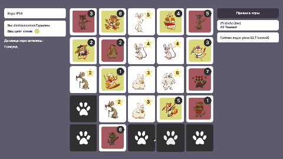

<div align="center">
  
  
  # Карманные Кошки
  
  Браузерная онлайн-игра для двух игроков с базой данных и real-time обновлениями!
  
  [Посмотреть демо-видео](#демо-видео) · [Перейти к игре](https://se.ifmo.ru/~s368382/pocketCats/entrance.html)
</div>

---

## О проекте

"Карманные Кошки" — это многопользовательская браузерная игра, в которой два игрока соревнуются за контроль над полем 5×5. Игроки открывают тайлы, перемещают их и собирают добычу, чтобы набрать максимальное количество очков.

Игра создана на основе реальной настольной игры ["Карманные Кошки"](https://hobbygames.ru/download/rules/karmannie-koshki-rules.pdf) (авторы: Александр Агилар и Ромарик Галоннье). Правила были упрощены и немного изменены для адаптации под онлайн-формат.

### Основные возможности

- Регистрация и авторизация пользователей
- Создание и присоединение к игровым комнатам
- Реалтайм-обновление состояния игры
- Интуитивный интерфейс с визуальной обратной связью
- Подсчёт очков и определение победителя

## Технологии


- **Frontend:** HTML5, CSS3, JavaScript (Vanilla)
- **Backend:** PHP 7.4+
- **База данных:** PostgreSQL
- **Архитектура:** RESTful API

## Структура проекта

```
pocketCats/
├── api/                    # PHP API endpoints
│   ├── config.php          # Конфигурация БД
│   ├── register.php        # Регистрация
│   ├── login.php           # Авторизация
│   ├── create_room.php     # Создание комнаты
│   ├── get_rooms.php       # Список комнат
│   ├── join_room.php       # Присоединение к комнате
│   ├── get_game_state.php  # Состояние игры
│   ├── open_tile.php       # Открытие тайла
│   ├── move_tile.php       # Перемещение тайла
│   └── ...
├── css/
│   └── style.css           # Стили приложения
├── img/                    # Изображения игры (тайлы, логотипы)
├── pic/                    # Скриншоты и демо-видео
├── entrance.html           # Страница входа
├── registration.html       # Страница регистрации
├── rooms.html              # Список комнат
├── game.html               # Игровое поле
└── rules.html              # Правила игры
```

## Основные компоненты

### 1. Система авторизации

Регистрация и вход реализованы через токен-аутентификацию:

```php
// api/register.php
$stmt = $conn->prepare("SELECT register_user(:login, :password) AS token");
$stmt->execute([
    ':login' => $login,
    ':password' => password_hash($password, PASSWORD_DEFAULT)
]);
```

### 2. Работа с базой данных

Вся игровая логика реализована через хранимые процедуры PostgreSQL (PL/pgSQL). Это обеспечивает целостность данных и централизованную обработку правил игры на уровне БД.

**Основные функции:**

- `register_user()` — регистрация пользователя и генерация токена
- `authorize_user()` — авторизация по логину и паролю
- `create_room()` — создание игровой комнаты и размещение тайлов на поле
- `join_room()` — присоединение второго игрока к комнате
- `open_tile()` — открытие тайла по координатам
- `move_tile()` — перемещение открытого тайла на допустимую позицию
- `get_game_state_json()` — получение полного состояния игры в формате JSON
- `finish_game()` — подсчёт очков и определение победителя

**Пример функции открытия тайла:**

```sql
CREATE OR REPLACE FUNCTION open_tile(
    p_token   TEXT,
    p_game_id INT,
    p_x       INT,
    p_y       INT
) RETURNS JSON AS $$
DECLARE
    v_login              TEXT;
    v_player_id          INT;
    v_tile_in_game_id    INT;
    v_type               tile_type;
BEGIN
    -- Проверка токена и получение логина
    SELECT ut.login INTO v_login
    FROM user_tokens ut
    WHERE ut.token = p_token;
    
    -- Проверка, что сейчас ход этого игрока
    -- ... логика определения текущего игрока ...
    
    -- Открытие тайла
    UPDATE tilesingames
    SET status = 'opened'
    WHERE gameID = p_game_id
      AND coordinateX = p_x
      AND coordinateY = p_y;
    
    -- Сохранение активного тайла для игрока
    INSERT INTO current_open_tiles (gameID, playerID, tileInGameID)
    VALUES (p_game_id, v_player_id, v_tile_in_game_id);
    
    RETURN json_build_object('status', 'success', ...);
END;
$$ LANGUAGE plpgsql;
```

**Пример функции перемещения тайла:**

```sql
CREATE OR REPLACE FUNCTION move_tile(
    p_token    TEXT,
    p_game_id  INT,
    p_target_x INT,
    p_target_y INT
) RETURNS JSON AS $$
DECLARE
    v_type   tile_type;
    v_x      INT;
    v_y      INT;
BEGIN
    -- Получение типа и координат активного тайла
    SELECT t.type, tig.coordinateX, tig.coordinateY
    INTO v_type, v_x, v_y
    FROM tilesingames tig
    JOIN tiles t ON t.tileID = tig.tileID
    WHERE tig.tileInGameID = v_tile_in_game_id;
    
    -- Валидация хода в зависимости от типа тайла
    IF v_type = 'prey' THEN
        -- Добыча: только соседние 8 клеток
        IF NOT (p_target_x BETWEEN v_x - 1 AND v_x + 1 AND
                p_target_y BETWEEN v_y - 1 AND v_y + 1) THEN
            RETURN json_build_object('status', 'error', ...);
        END IF;
    ELSIF v_type = 'cat' THEN
        -- Кот: на 1-2 клетки по вертикали/горизонтали
        IF NOT ((p_target_x = v_x AND ABS(p_target_y - v_y) IN (1,2))
                OR (p_target_y = v_y AND ABS(p_target_x - v_x) IN (1,2))) THEN
            RETURN json_build_object('status', 'error', ...);
        END IF;
    END IF;
    
    -- Обмен местами тайлов
    UPDATE tilesingames SET coordinateX = v_x, coordinateY = v_y
    WHERE tileInGameID = v_target_tile_in_game;
    
    UPDATE tilesingames SET coordinateX = p_target_x, coordinateY = p_target_y
    WHERE tileInGameID = v_tile_in_game_id;
    
    RETURN json_build_object('status', 'ok', ...);
END;
$$ LANGUAGE plpgsql;
```

**Пример функции подсчёта очков:**

```sql
CREATE OR REPLACE FUNCTION finish_game(p_game_id INT) RETURNS VOID AS $$
DECLARE
    prey_rec RECORD;
    v_winner_clan VARCHAR(50);
BEGIN
    -- Для каждой добычи считаем силу котов вокруг
    FOR prey_rec IN
        SELECT tig.coordinateX, tig.coordinateY, t.power
        FROM tilesingames tig
        JOIN tiles t ON t.tileID = tig.tileID
        WHERE tig.gameID = p_game_id AND t.type = 'prey'
    LOOP
        -- Подсчёт суммарной силы каждого клана вокруг добычи
        SELECT clanName INTO v_winner_clan
        FROM (
            SELECT tc.clanName, SUM(t_cat.power) AS total_power
            FROM tilesingames tig_cat
            JOIN tiles t_cat ON t_cat.tileID = tig_cat.tileID
            JOIN tilesclans tc ON tc.tileID = t_cat.tileID
            WHERE tig_cat.gameID = p_game_id
              AND t_cat.type = 'cat'
              AND (tig_cat.coordinateX, tig_cat.coordinateY) 
                  IN ((prey_rec.coordinateX+1, prey_rec.coordinateY),
                      (prey_rec.coordinateX-1, prey_rec.coordinateY),
                      (prey_rec.coordinateX, prey_rec.coordinateY+1),
                      (prey_rec.coordinateX, prey_rec.coordinateY-1))
            GROUP BY tc.clanName
            ORDER BY total_power DESC
            LIMIT 1
        ) winner;
        
        -- Начисление очков клану-победителю
        UPDATE players
        SET playerPoints = COALESCE(playerPoints, 0) + prey_rec.power
        WHERE gameID = p_game_id AND clan = v_winner_clan;
    END LOOP;
END;
$$ LANGUAGE plpgsql;
```

PHP-скрипты вызывают эти функции через PDO:

```php
// api/open_tile.php
$stmt = $conn->prepare('SELECT open_tile(:token, :game_id, :x, :y) AS data');
$stmt->execute([
    ':token'   => $token,
    ':game_id' => $game_id,
    ':x'       => $x,
    ':y'       => $y,
]);
$row = $stmt->fetch(PDO::FETCH_ASSOC);
echo $row['data']; // JSON-ответ от функции
```

### 3. Клиентская часть

Игровое поле обновляется в реальном времени через периодические запросы:

```javascript
// game.html
async function loadGameState() {
    const fd = new FormData();
    fd.append('token', token);
    fd.append('game_id', gameId);
    
    const state = await callApi('get_game_state.php', fd);
    renderInfo(state);
    renderBoard(state.tiles || []);
}

// Автообновление каждую секунду
startAutoUpdate(1000);
```

### 4. Обработка ходов

Игрок открывает тайл, затем перемещает его на допустимую позицию:

```javascript
// game.html
async function handleTileClick(index) {
    const tile = currentCells[index];
    
    // Открытие тайла
    if (selectedIndex === null) {
        if (tile.status !== 'closed') return;
        const {x, y} = indexToCoords(index);
        await callApi('open_tile.php', {x, y});
    }
    
    // Перемещение тайла
    else {
        const targetX = index % GRID_SIZE;
        const targetY = Math.floor(index / GRID_SIZE);
        await callApi('move_tile.php', {target_x: targetX, target_y: targetY});
    }
}
```

### 5. Визуализация игрового поля

Поле рендерится динамически на основе данных с сервера:

```javascript
// game.html
function renderBoard(tilesFromServer) {
    board.innerHTML = '';
    currentCells = new Array(GRID_SIZE * GRID_SIZE).fill(null);
    
    // Заполняем закрытые клетки
    for (let y = 0; y < GRID_SIZE; y++) {
        for (let x = 0; x < GRID_SIZE; x++) {
            currentCells[coordsToIndex(x, y)] = {
                coordinateX: x,
                coordinateY: y,
                status: 'closed'
            };
        }
    }
    
    // Накладываем открытые тайлы
    tilesFromServer.forEach(tile => {
        const x = tile.coordinateX;
        const y = tile.coordinateY;
        currentCells[coordsToIndex(x, y)] = tile;
    });
    
    // Создаём кнопки для каждой клетки
    for (let i = 0; i < GRID_SIZE * GRID_SIZE; i++) {
        const btn = document.createElement('button');
        btn.className = 'game-tile';
        const img = document.createElement('img');
        img.src = getTileImage(currentCells[i]);
        btn.appendChild(img);
        btn.addEventListener('click', () => handleTileClick(i));
        board.appendChild(btn);
    }
}
```

### 6. Вычисление допустимых ходов

В зависимости от типа тайла (кошка или добыча) вычисляются доступные позиции:

```javascript
// game.html
function computeAvailableTargets(tile, index) {
    const { x, y } = indexToCoords(index);
    const result = [];
    
    if (tile.type === 'prey') {
        // Добыча может переместиться на любую соседнюю клетку
        for (let dx = -1; dx <= 1; dx++) {
            for (let dy = -1; dy <= 1; dy++) {
                if (dx === 0 && dy === 0) continue;
                const nx = x + dx, ny = y + dy;
                if (nx >= 0 && nx < GRID_SIZE && ny >= 0 && ny < GRID_SIZE) {
                    result.push(coordsToIndex(nx, ny));
                }
            }
        }
    } else if (tile.type === 'cat') {
        // Кошка может переместиться на 1-2 клетки по вертикали/горизонтали
        [1, 2].forEach(step => {
            [
                {dx: step, dy: 0}, {dx: -step, dy: 0},
                {dx: 0, dy: step}, {dx: 0, dy: -step}
            ].forEach(({dx, dy}) => {
                const nx = x + dx, ny = y + dy;
                if (nx >= 0 && nx < GRID_SIZE && ny >= 0 && ny < GRID_SIZE) {
                    result.push(coordsToIndex(nx, ny));
                }
            });
        });
    }
    return [...new Set(result)];
}
```


## Скриншоты


*Страница входа в игру*


*Список доступных игровых комнат*


*Игровое поле в начале партии*


*Процесс игры с открытыми тайлами*


*Страница с правилами игры*


*Экран завершения игры с результатами*

## Демо-видео

<div align="center">
  
</div>

*Видео демонстрирует пример игрового процесса - ход одного игрока*

## Особенности реализации

- **Хранимые процедуры PostgreSQL:** Вся игровая логика (валидация ходов, подсчёт очков, управление состоянием) выполняется на уровне БД через PL/pgSQL функции. Это обеспечивает целостность данных и предотвращает некорректные состояния игры.
- **Реалтайм-обновления:** Состояние игры обновляется каждую секунду через AJAX-запросы к `get_game_state_json()`, которая возвращает полное состояние игры в формате JSON.
- **Токен-аутентификация:** Безопасная авторизация через токены, хранящиеся в localStorage. Токены генерируются при регистрации/входе и проверяются при каждом запросе к API.
- **Адаптивный дизайн:** Интерфейс адаптируется под разные размеры экранов с использованием CSS Flexbox и Grid.
- **Визуальная обратная связь:** Подсветка доступных ходов и выбранных тайлов для улучшения пользовательского опыта.

## Настройка для локального запуска

1. Скопируйте `api/config.php.example` в `api/config.php`
2. Заполните данные подключения к вашей базе данных PostgreSQL:
   ```php
   $host     = "your_host";
   $port     = "5432";
   $dbname   = "your_database";
   $user     = "your_username";
   $password = "your_password";
   ```
3. Создайте необходимые таблицы и хранимые процедуры в PostgreSQL (см. `pocketCats.txt`)

---

<div align="center">

**Автор:** Кручинина Дарья

Проект разработан в рамках учебного курса.

[Демо игры](https://se.ifmo.ru/~s368382/pocketCats/entrance.html) · [Правила оригинальной игры](https://hobbygames.ru/download/rules/karmannie-koshki-rules.pdf)

</div>
